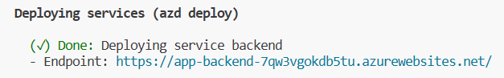

# Our team won the first prize :) Details here: https://tinyurl.com/aichemistswinner

**Team Name**: A.I.chemists 

**Team members**: Tanvir Ahmed (tanvir@uwm.edu), Nayan Banik (nbanik@uwm.edu), Md Tanzil Shahria (mshahria@uwm.edu), and Anisha Tasnim (tasnim@uwm.edu) 

Project details are provided in the [Project documentation](assets/Documentation_AIchemists.pdf).

The deployed applications can be viewed on [UWM CSI Chat Engine (GPT-4-turbo-updated-dataset) ](https://tinyurl.com/gpt4bot).

The code is based on [azure-search-openai-demo](https://github.com/Azure-Samples/azure-search-openai-demo). 

** Instructions to run the project files **

## Azure account requirements:

**IMPORTANT:** In order to deploy and run this project, you'll need:

* **Azure account**. If you're new to Azure, [get an Azure account for free](https://azure.microsoft.com/free/cognitive-search/) and you'll get some free Azure credits to get started.
* **Azure subscription with access enabled for the Azure OpenAI service**. You can request access with [this form](https://aka.ms/oaiapply). If your access request to Azure OpenAI service doesn't match the [acceptance criteria](https://learn.microsoft.com/legal/cognitive-services/openai/limited-access?context=%2Fazure%2Fcognitive-services%2Fopenai%2Fcontext%2Fcontext), you can use [OpenAI public API](https://platform.openai.com/docs/api-reference/introduction) instead. Learn [how to switch to an OpenAI instance](#switching-from-an-azure-openai-endpoint-to-an-openai-instance).
* **Azure account permissions**:
  * Your Azure account must have `Microsoft.Authorization/roleAssignments/write` permissions, such as [Role Based Access Control Administrator](https://learn.microsoft.com/azure/role-based-access-control/built-in-roles#role-based-access-control-administrator-preview), [User Access Administrator](https://learn.microsoft.com/azure/role-based-access-control/built-in-roles#user-access-administrator), or [Owner](https://learn.microsoft.com/azure/role-based-access-control/built-in-roles#owner). If you don't have subscription-level permissions, you must be granted [RBAC](https://learn.microsoft.com/azure/role-based-access-control/built-in-roles#role-based-access-control-administrator-preview) for an existing resource group and [deploy to that existing group](#existing-resource-group).
  * Your Azure account also needs `Microsoft.Resources/deployments/write` permissions on the subscription level.

## Azure deployment:

### Cost estimation

Pricing varies per region and usage, so it isn't possible to predict exact costs for your usage.
However, you can try the [Azure pricing calculator](https://azure.com/e/8ffbe5b1919c4c72aed89b022294df76) for the resources below.

- Azure App Service: Basic Tier with 1 CPU core, 1.75 GB RAM. Pricing per hour. [Pricing](https://azure.microsoft.com/pricing/details/app-service/linux/)
- Azure OpenAI: Standard tier, ChatGPT and Ada models. Pricing per 1K tokens used, and at least 1K tokens are used per question. [Pricing](https://azure.microsoft.com/en-us/pricing/details/cognitive-services/openai-service/)
- Azure AI Document Intelligence: SO (Standard) tier using pre-built layout. Pricing per document page, sample documents have 261 pages total. [Pricing](https://azure.microsoft.com/pricing/details/form-recognizer/)
- Azure AI Search: Standard tier, 1 replica, free level of semantic search. Pricing per hour. [Pricing](https://azure.microsoft.com/pricing/details/search/)
- Azure Blob Storage: Standard tier with ZRS (Zone-redundant storage). Pricing per storage and read operations. [Pricing](https://azure.microsoft.com/pricing/details/storage/blobs/)
- Azure Monitor: Pay-as-you-go tier. Costs based on data ingested. [Pricing](https://azure.microsoft.com/pricing/details/monitor/)

To reduce costs, you can switch to free SKUs for Azure App Service and Azure AI Document Intelligence by changing the parameters file under the `infra` folder. There are some limits to consider; for example, the free Azure AI Document Intelligence resource only analyzes the first 2 pages of each document. You can also reduce costs associated with the Azure AI Document Intelligence by reducing the number of documents in the `data` folder, or by removing the postprovision hook in `azure.yaml` that runs the `prepdocs.py` script.

⚠️ To avoid unnecessary costs, remember to take down your app if it's no longer in use,
either by deleting the resource group in the Portal or running `azd down`.

#### Local environment

First install the required tools:

* [Azure Developer CLI](https://aka.ms/azure-dev/install)
* [Python 3.9, 3.10, or 3.11](https://www.python.org/downloads/)
  * **Important**: Python and the pip package manager must be in the path in Windows for the setup scripts to work.
  * **Important**: Ensure you can run `python --version` from console. On Ubuntu, you might need to run `sudo apt install python-is-python3` to link `python` to `python3`.
* [Node.js 14+](https://nodejs.org/en/download/)
* [Git](https://git-scm.com/downloads)
* [Powershell 7+ (pwsh)](https://github.com/powershell/powershell) - For Windows users only.
  * **Important**: Ensure you can run `pwsh.exe` from a PowerShell terminal. If this fails, you likely need to upgrade PowerShell.

Then clone the project code or download as zip and extract to a folder. Inside the project folder, run in the terminal `azd auth login`.

### Deploying from scratch

Execute the following command, if you don't have any pre-existing Azure services and want to start from a fresh deployment.

1. Run `azd up` - This will provision Azure resources and deploy this sample to those resources, including building the search index based on the files found in the `./data` folder.
    * **Important**: Beware that the resources created by this command will incur immediate costs, primarily from the AI Search resource. These resources may accrue costs even if you interrupt the command before it is fully executed. You can run `azd down` or delete the resources manually to avoid unnecessary spending.
    * You will be prompted to select two locations, one for the majority of resources and one for the OpenAI resource, which is currently a short list. That location list is based on the [OpenAI model availability table](https://learn.microsoft.com/azure/cognitive-services/openai/concepts/models#model-summary-table-and-region-availability) and may become outdated as availability changes.
1. After the application has been successfully deployed you will see a URL printed to the console.  Click that URL to interact with the application in your browser.

It will look like the following:

> NOTE: It may take 5-10 minutes for the application to be fully deployed. If you see a "Python Developer" welcome screen or an error page, then wait a bit and refresh the page.

### Deploying with existing Azure resources

If you already have existing Azure resources, you can re-use those by setting `azd` environment values.

#### Existing resource group

1. Run `azd env set AZURE_RESOURCE_GROUP {Name of existing resource group}`
1. Run `azd env set AZURE_LOCATION {Location of existing resource group}`

#### Existing OpenAI resource

##### Azure OpenAI:

1. Run `azd env set AZURE_OPENAI_SERVICE {Name of existing OpenAI service}`
1. Run `azd env set AZURE_OPENAI_RESOURCE_GROUP {Name of existing resource group that OpenAI service is provisioned to}`
1. Run `azd env set AZURE_OPENAI_CHATGPT_DEPLOYMENT {Name of existing ChatGPT deployment}`. Only needed if your ChatGPT deployment is not the default 'chat'.
1. Run `azd env set AZURE_OPENAI_EMB_DEPLOYMENT {Name of existing GPT embedding deployment}`. Only needed if your embeddings deployment is not the default 'embedding'.

When you run `azd up` after and are prompted to select a value for `openAiResourceGroupLocation`, make sure to select the same location as the existing OpenAI resource group.

##### Openai.com OpenAI:

1. Run `azd env set OPENAI_HOST openai`
2. Run `azd env set OPENAI_ORGANIZATION {Your OpenAI organization}`
3. Run `azd env set OPENAI_API_KEY {Your OpenAI API key}`
4. Run `azd up`

You can retrieve your OpenAI key by checking [your user page](https://platform.openai.com/account/api-keys) and your organization by navigating to [your organization page](https://platform.openai.com/account/org-settings).
Learn more about creating an OpenAI free trial at [this link](https://openai.com/pricing).
Do *not* check your key into source control.

When you run `azd up` after and are prompted to select a value for `openAiResourceGroupLocation`, you can select any location as it will not be used.

#### Existing Azure AI Search resource

1. Run `azd env set AZURE_SEARCH_SERVICE {Name of existing Azure AI Search service}`
1. Run `azd env set AZURE_SEARCH_SERVICE_RESOURCE_GROUP {Name of existing resource group with ACS service}`
1. If that resource group is in a different location than the one you'll pick for the `azd up` step,
  then run `azd env set AZURE_SEARCH_SERVICE_LOCATION {Location of existing service}`
1. If the search service's SKU is not standard, then run `azd env set AZURE_SEARCH_SERVICE_SKU {Name of SKU}`. The free tier won't work as it doesn't support managed identity. If your existing search service is using the free tier, you will need to deploy a new service since [search SKUs cannot be changed](https://learn.microsoft.com/azure/search/search-sku-tier#tier-upgrade-or-downgrade). ([See other possible SKU values](https://learn.microsoft.com/azure/templates/microsoft.search/searchservices?pivots=deployment-language-bicep#sku))
1. If you have an existing index that is set up with all the expected fields, then run `azd env set AZURE_SEARCH_INDEX {Name of existing index}`. Otherwise, the `azd up` command will create a new index.

You can also customize the search service (new or existing) for non-English searches:

1. To configure the language of the search query to a value other than "en-US", run `azd env set AZURE_SEARCH_QUERY_LANGUAGE {Name of query language}`. ([See other possible values](https://learn.microsoft.com/rest/api/searchservice/preview-api/search-documents#queryLanguage))
1. To turn off the spell checker, run `azd env set AZURE_SEARCH_QUERY_SPELLER none`. Consult [this table](https://learn.microsoft.com/rest/api/searchservice/preview-api/search-documents#queryLanguage) to determine if spell checker is supported for your query language.
1. To configure the name of the analyzer to use for a searchable text field to a value other than "en.microsoft", run `azd env set AZURE_SEARCH_ANALYZER_NAME {Name of analyzer name}`. ([See other possible values](https://learn.microsoft.com/dotnet/api/microsoft.azure.search.models.field.analyzer?view=azure-dotnet-legacy&viewFallbackFrom=azure-dotnet))

#### Other existing Azure resources

You can also use existing Azure AI Document Intelligence and Storage Accounts. See `./infra/main.parameters.json` for list of environment variables to pass to `azd env set` to configure those existing resources.

## Running locally

You can only run locally **after** having successfully run the `azd up` command. If you haven't yet, follow the steps in [Azure deployment](#azure-deployment) above.

1. Run `azd auth login`
2. Change dir to `app`
3. Run `./start.ps1` or `./start.sh` or run the "VS Code Task: Start App" to start the project locally.

## Using the app

* In Azure: navigate to the Azure WebApp deployed by azd. The URL is printed out when azd completes (as "Endpoint"), or you can find it in the Azure portal.
* Running locally: navigate to 127.0.0.1:50505

## Clean up

To clean up all the resources created by this sample:

1. Run `azd down`
2. When asked if you are sure you want to continue, enter `y`
3. When asked if you want to permanently delete the resources, enter `y`

The resource group and all the resources will be deleted.

For additional help and troubleshooting, visit [azure-search-openai-demo](https://github.com/Azure-Samples/azure-search-openai-demo). 
