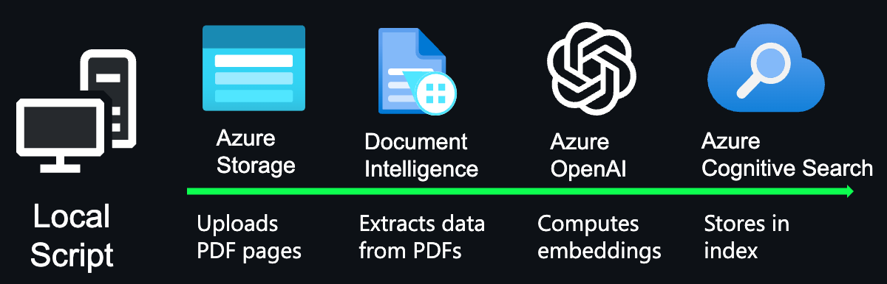

# CSI Hackathon (Theme 2: Generative & Natural Language) 

**Team Name**: A.I.chemists 

**Team members**: Tanvir Ahmed (tanvir@uwm.edu), Nayan Banik (nbanik@uwm.edu), Md Tanzil Shahria (mshahria@uwm.edu), and Anisha Tasnim (tasnim@uwm.edu) 

**Project Overview**: The project aims to revolutionize the way individuals, particularly those without a technical background, engage with and understand the UWM CSI advanced manufacturing test bed. The cornerstone of this endeavor is the development of a state-of-the-art intelligent chat engine, designed to function as a virtual guide.
The primary objective of this innovative chatbot is to demystify the complex operations and cutting-edge technologies that underpin the advanced manufacturing test bed. In an industry characterized by its technical profundity and specialized knowledge, this chat engine stands as a bridge between complex technical information and its simplified, more accessible interpretation. It achieves this by employing advanced artificial intelligence technologies that possess the capability to meticulously extract and process critical information from proprietary operating manuals and detailed technical handbooks. The chatbot then transforms this high-level technical data into easily interpretable everyday language, tailored to be comprehensible to a broad audience.

One of the most significant anticipated impacts of this project lies in its potential to enhance educational understanding across diverse groups. By making complex industrial operations more accessible and easier to comprehend, the chatbot not only serves as an educational tool but also as a catalyst for fostering broader participation in discussions and explorations of industrial innovation. This is particularly valuable in an era where advanced manufacturing is rapidly evolving and where understanding these changes is crucial for a wide range of stakeholders, from students and educators to industry professionals and policymakers.

Furthermore, this project exemplifies the transformative potential of artificial intelligence in bridging knowledge gaps. It highlights how AI can be harnessed to make technical knowledge more inclusive, approachable, and universally accessible. In sectors where complexity and specialized language often serve as barriers to broader engagement and understanding, this chatbot represents a paradigm shift, offering a more democratized approach to learning and engaging with advanced manufacturing technologies. In summary, this not just a technological advancement; it is a step towards redefining how we interact with and understand the complex world of advanced manufacturing. Its impact extends beyond the confines of UWM CSI, setting a precedent for how artificial intelligence can be utilized to make specialized knowledge more accessible and to inspire innovation and participation across a spectrum of audiences.

**Technical Documentation**: The technical foundation of our project leverages Azure's robust cloud capabilities and OpenAI's advanced language models. Our chatbot is built on the Retrieval-Augmented Generation (RAG) pattern, which combines the strengths of Azure AI Search and Azure OpenAI. Azure AI Search plays a pivotal role in data indexing and retrieval. The chatbot can rapidly access a wide array of information by organizing and indexing detailed user manuals and other technical documents related to the manufacturing test bed. This setup ensures the chatbot retrieves the most relevant and accurate data in response to user inquiries. The code is based on [azure-search-openai-demo](https://github.com/Azure-Samples/azure-search-openai-demo).

  **Frontend Technologies**

**React**: React is a JavaScript library for building user interfaces, especially single-page applications. It's known for its efficiency in rendering dynamic content and managing state across components. In this project, React is utilized to create a seamless and interactive user interface. It manages the chatbot's state, handles user interactions, and updates the UI in real time as users engage with the chatbot. React's component-based architecture makes the chatbot's frontend modular and scalable. It enables the development team to reuse components and manage the UI's state more efficiently, leading to a faster and smoother user experience.

**Fluent UI**: Fluent UI is a collection of UX frameworks for creating web and mobile applications that share Microsoft's design language. It provides a set of reusable, accessible components that conform to Microsoft’s design standards. Fluent UI components are integrated into the React application to ensure a consistent and familiar look and feel, aligning with Microsoft's design principles. These components are used to build various elements of the chatbot's interface, such as buttons, input fields, and layout structures. By using Fluent UI, the chatbot inherits a professional and polished appearance that is visually appealing and user-friendly. The consistency in design helps in providing a smooth user experience and ensures accessibility standards are met.

  **Backend Technologies**
  
**Quart**: Quart is an asynchronous Python web framework. It allows developers to build web applications that can handle large numbers of simultaneous connections and data requests efficiently. Quart serves as the backbone of the chatbot's backend. It manages asynchronous tasks, processes user requests, and handles the interactions between the frontend, AI components, and the data storage system. Quart's asynchronous capabilities are essential for a chatbot application where real-time data processing and response generation are crucial. It improves the chatbot's performance by enabling faster handling of concurrent user interactions.

  **AI and Data Handling Technologies**
  
**Azure AI Search**: Azure AI Search is a cloud search service with built-in artificial intelligence capabilities. It allows for the indexing and querying of large volumes of data efficiently. Azure AI Search is used to index and retrieve information from the uploaded PDF documents. It powers the chatbot's ability to search through extensive data sets and find relevant information in response to user queries. The use of Azure AI Search enhances the chatbot's functionality in terms of data retrieval and processing. Its AI capabilities allow for more accurate and relevant search results, improving the overall effectiveness of the chatbot.

**Azure Blob Storage**: Azure Blob Storage is Microsoft's object storage solution for the cloud. It is optimized for storing massive amounts of unstructured data, such as text or binary data. Azure Blob Storage is utilized to store the chatbot's data, primarily the PDF documents that serve as the knowledge base. It ensures that the data is securely and efficiently managed. By using Azure Blob Storage, the chatbot benefits from a high degree of scalability and security in data management. It supports the chatbot's need for a robust and reliable storage solution that can handle large volumes of data.

**OpenAI ChatCompletion API**: The OpenAI ChatCompletion API is part of OpenAI's suite of tools that offer advanced natural language processing capabilities. It is designed to generate human-like text based on the input provided. This API is crucial in transforming user queries into enhanced search queries and generating human-like, contextually relevant responses based on the data retrieved from Azure AI Search. The integration of the OpenAI ChatCompletion API brings a high level of sophistication to the chatbot's conversational abilities. It allows the chatbot to understand and respond to queries in a way that is natural and intuitive for users.

**Azure OpenAI Service**: The chatbot's intelligence is powered by Azure OpenAI Service, which accesses the gpt-3.5-turbo model. This model is adept at understanding and generating human-like text, enabling the chatbot to provide accurate, contextually relevant, and engaging responses. 

**System Architecture**: The architecture supports real-time interactions, minimizing latency between query input and response output. Azure AI Search and OpenAI are seamlessly integrated, ensuring a smooth data flow and consistent performance. The chatbot offers a ChatGPT-style interaction, maintaining a natural, engaging conversation flow, with features to track source content and evaluate the trustworthiness of responses. The following diagram is adapted from [azure-search-openai-demo](https://github.com/Azure-Samples/azure-search-openai-demo) illustrates the interaction between the user queries, Azure AI Search, OpenAI's response generation, and the chat interface. 

**Data Preprocessing Steps**: The data preprocessing involves several steps to ensure the chatbot can efficiently process and retrieve information from the provided PDF documents. The following diagram adapted from [azure-search-openai-demo](https://github.com/Azure-Samples/azure-search-openai-demo) illustrates the preprocessing pipelines. 

**Document Upload and Indexing**: PDFs are uploaded to Azure Blob Storage and indexed for easy retrieval.

**Chunking of PDFs**: To address token limits in OpenAI API and enhance context sensitivity, PDFs are split into smaller chunks using a sliding window approach. This is handled by the scripts/prepdocs.py script.

**Updating Indexes**: The system is designed to check for changes in the documents, avoiding re-uploading unchanged files, thereby optimizing the data ingestion process.

**Team Contribution**: The team's collaborative effort was pivotal in the successful development of the chatbot. Tanvir, as the team leader, orchestrated the project's overall direction and strategy, focusing on team management, data preprocessing, and contributing significantly to the model training process alongside Nayan. Nayan, as the key person in data training and model preparation, was instrumental in harnessing the capabilities of Azure OpenAI for the chatbot's language processing features. Tanzil played a crucial role in the frontend development, ensuring the chatbot's interface was user-friendly and intuitive, while also managing the project documentation. Anisha, with her focus on Q&A, was central in evaluating and refining the chatbot's performance, ensuring its responses were accurate, clear, and easily understandable. Her contributions were essential in enhancing the chatbot's usability, making it accessible and beneficial for users regardless of their background in manufacturing. 

**Challenges and Solutions**: In addressing the core challenges of our project, we implemented targeted solutions to enhance the chatbot's functionality. To ensure information accuracy, Azure AI Search was integrated to source data from the latest user manuals and manufacturing guides, ensuring the chatbot's responses are grounded in current and reliable information. The chatbot uses a step-by-step explanation method to break down complex operations, simplifying intricate manufacturing processes into basic concepts for easy comprehension. Finally, to tackle technical integration and customization, we meticulously configured and tested the integrated model, tailoring the data retrieval and response generation to fit the unique requirements of the advanced manufacturing test bed. 

**Performance**:  

**Future Work**: For future project enhancements, we plan to focus on several key areas. We aim to expand the chatbot's knowledge base by incorporating more structured and diverse data. This will enhance the chatbot's performance and broaden its understanding of various manufacturing concepts. We also intend to introduce multi-language support to make the tool accessible to a wider audience, transcending language barriers. 
